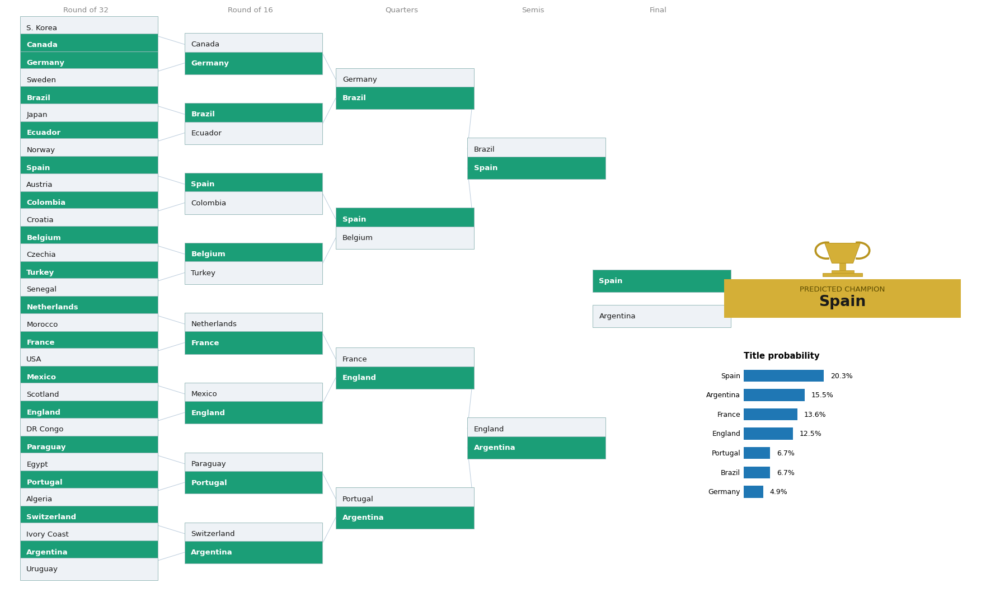
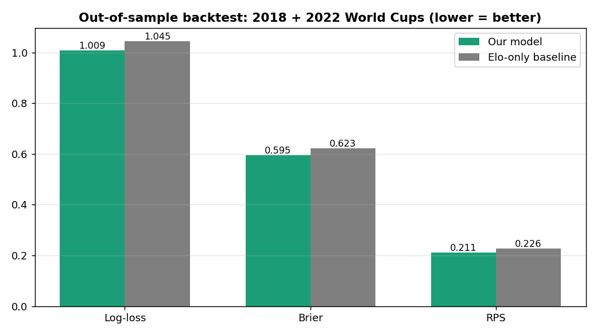

# Black-Litterman World Cup 2026 Predictor



**A statistical World Cup model you can impose your own football judgement on, using the Black-Litterman framework from portfolio management.**
Built with Python, pandas, scikit-learn, scipy, Streamlit and Plotly.

### 🔗 [**Try the live interactive dashboard →**](https://world-cup-black-litterman-model-6b7d8lkdzw5fjmkba4mqhq.streamlit.app/)

Set your own views and watch the bracket re-forecast live, simulate any head-to-head with Dixon-Coles scoreline probabilities, see per-group advancement odds, and compare the model to the betting market. No installation needed.

---

## Table of contents
1. [The idea](#1-the-idea)
2. [Headline forecast](#2-headline-forecast)
3. [The data](#3-the-data)
4. [How the model works](#4-how-the-model-works)
5. [The thinking behind the key choices](#5-the-thinking-behind-the-key-choices)
6. [How we stress-tested it](#6-how-we-stress-tested-it)
7. [Drawbacks and limitations](#7-drawbacks-and-limitations)
8. [What we deliberately left out](#8-what-we-deliberately-left-out)
9. [Running it](#9-running-it)
10. [Data sources and acknowledgments](#10-data-sources-and-acknowledgments)

---

## 1. The idea

Every World Cup model online is a pure statistics engine, and they nearly all converge on the same answer. The genuinely hard, unsolved part of football forecasting is that **human judgement still beats the machines**: knowing a squad is ageing, that a team always chokes in knockouts, or that a dark horse is peaking. This project is built around exactly that gap.

It treats a calibrated statistical model as the **equilibrium** and lets a person layer their own **views** on top, each weighted by confidence, using **Black-Litterman**, the same maths that blends market-implied returns with an investor's views in portfolio management. The statistical model is the prior; your football knowledge is the views; a Monte-Carlo simulation of the real 2026 bracket turns the blended result into title odds.

This was built as a companion to a separate [equity Black-Litterman project](https://github.com/l3wisdang/black-litterman-sector-rotation), to show the same framework transfers cleanly from finance to a completely different domain.

## 2. Headline forecast

Win probabilities from 20,000 simulations, forecast **pre-tournament** (the 2026 games already played are held out as a test set):

| Team | Statistical model | + Judgement views | Betting market |
|---|---|---|---|
| Spain | 20.2% | 21.6% | 14.2% |
| France | 13.7% | 17.1% | 17.0% |
| Argentina | 14.9% | 10.7% | 8.5% |
| England | 13.3% | 11.9% | 10.6% |
| Germany | 4.9% | 4.7% | 5.7% |
| Brazil | 6.7% | 5.4% | 7.7% |
| Portugal | 6.1% | 6.6% | 9.4% |

**The model is validated where it can be.** On the 2018 and 2022 World Cups, trained only on prior data, the engine beats an Elo-only baseline out of sample: **3.4% lower log-loss, 4.5% lower Brier, 6.6% lower RPS** (pooled). Those metrics reward well-calibrated probabilities, not just picking winners.



## 3. The data

- **International match results, 1872 to 2026** (martj42 / Kaggle). Fitted on 2010 onward, with time decay so the last ~2-3 years dominate.
- **The official 2026 World Cup draw and bracket**: all 48 teams, 12 groups, and FIFA's exact knockout template including the best-third-placed routing rules.
- **Transfermarkt squad market values** (June 2026, all 48 teams) and **EA FC 26 national-team ratings** (contenders) for the squad-quality signal.
- **Every real World Cup penalty-shootout kick since 1982** (jfjelstul dataset, 397 kicks) for the penalty model.
- **Betting-market outright odds** (FanDuel / bet365 consensus) as a benchmark.
- **Current injuries and tournament xG** for the judgement views.

## 4. How the model works

The pipeline runs in four stages.

### Stage 1: build the statistical ratings (the equilibrium)

This is the validated core. Each team gets an attack rating, a defence rating, and a combined strength, from three signals:

1. **Match results, via a time-decayed, opponent-weighted Dixon-Coles model.** Every match becomes two Poisson observations (home goals, away goals). Expected goals are `intercept + attack[scorer] + defence[conceder] + home advantage + a small Elo term`, fitted with a regularised Poisson regression (scikit-learn). Each match is weighted by exponential **time decay** (2-year half-life), **competition importance** (friendlies count 0.15), and **opponent strength** (beating or shutting out a strong side counts more than thrashing a minnow). A Dixon-Coles correction fixes plain Poisson's under-counting of 0-0 and 1-1 scorelines.
2. **Elo**, computed over the full match history, enters as a covariate. Its fitted weight is small (~7% of the spread between teams) because the results already capture most of team strength.
3. **Squad quality**: standardised log market value blended with EA ratings, added as a strength adjustment. It is weighted to be roughly co-equal with results (~47% of the spread).

The model is trained **as of just before kickoff**, so the 2026 games already played are a genuine held-out test set, not training data.

### Stage 2: add judgement (Black-Litterman)

The ratings are the prior. We then layer editable, sourced **views**, the things the stats cannot see: analyst dark-horse calls, current injuries, underlying xG, an ageing-Argentina discount, a France-to-deliver call, plus any of your own. The Black-Litterman master formula,

```
posterior = [(τΣ)⁻¹ + PᵀΩ⁻¹P]⁻¹ [(τΣ)⁻¹ π + PᵀΩ⁻¹Q]
```

blends the prior `π` and the views `(P, Q)`, each weighted by a confidence `Ω`, into posterior ratings. We apply it to ratings (unbounded), not probabilities, so the update is well-posed; the simulator restores the sum-to-one constraint, exactly the way a portfolio optimiser handles the budget constraint in finance.

### Stage 3: simulate the tournament (20,000 runs)

Each simulation:
1. Draws a **per-team form shock** (tournament unpredictability) applied across all that team's games, modelling that a side can have a good or bad whole tournament (fatigue, a key injury, being figured out). This is a single random adjustment per team per simulation, correlated across its matches.
2. Plays all **72 group games** by drawing Poisson scorelines, and ranks each group by points, goal difference, goals scored, then head-to-head.
3. Selects the **8 best third-placed teams** and routes everyone into the **official FIFA bracket** via a constraint-satisfaction matching.
4. Plays the **knockouts**: Poisson scorelines, with draws going to extra time (reduced scoring) and then a **penalty shootout decided by real shootout pedigree** (a modest edge).
5. Records each team's champion and round reached.

Aggregating gives every team's probability of winning, reaching the final, the semis, and so on, plus a bracket-path-difficulty score.

### Stage 4: benchmark

The output is compared against the de-vigged betting market, the sharpest external benchmark, giving a "Human vs AI vs Market" view in the dashboard.

## 5. The thinking behind the key choices

- **Why Dixon-Coles + Elo, not deep learning?** Football has few reliable features, so well-specified statistical models match or beat black-box ML and stay interpretable, which the Black-Litterman layer needs (it requires a strength parameter to impose views on). Both leading public 2026 models made the same choice.
- **Why time decay instead of a hard cutoff?** Teams change, so recent matches should dominate; exponential decay does this smoothly. The half-life was tuned on out-of-sample performance (~2-3 years).
- **Why opponent-strength weighting?** A clean sheet against a strong side is worth more than against a minnow. Adding this improved out-of-sample accuracy.
- **Why squad value?** Recent results have a blind spot: a great record against weak opposition, or an ageing squad whose results lag its decline. Squad market value (which is age-sensitive) corrects this. It is a deliberate "squad-led" choice, weighted roughly co-equal with results.
- **Why Black-Litterman?** It is the principled way to combine a defensible baseline with subjective views by confidence, which is exactly what football demands. It also keeps evidence and opinion cleanly separated.
- **Why a form random effect instead of just shrinking ratings?** A naive simulator treats every match as independent, so the favourite over-concentrates (a strong team's path looks too clean). The form shock injects correlated tournament variance, which widens the tails at the source rather than masking it with an arbitrary softening knob.
- **Why pre-tournament?** So the forecast is a clean prediction and the 2026 games stay a held-out test set we can score the model against live.

## 6. How we stress-tested it

Most of the value here is not the final number, it is that we interrogated the model harder than the public ones did:

- **Out-of-sample backtest** on 2018 and 2022 (beats Elo on three metrics).
- **Regularisation, half-life, temperature and opponent-weighting** all tuned by out-of-sample log-loss, not by hand.
- **A deep diagnosis of why our Argentina rating ran higher than two other public models.** We traced it to specific causes (an over-weighted penalty model and conditioning on an easy opening result, not bad data), confirmed our ratings actually *match* the other models, and fixed it on principle. After the fixes, Argentina sits at ~11%, in line with the consensus.
- **A direct comparison to two independent public models** (a Poisson + Elo model and an Elo + FIFA-ratings model). Both reached similar answers via different methods, which we took as a signal to take seriously rather than dismiss.

The honest conclusion: the match-level model is validated and trustworthy; the title-odds *level* for any one team cannot be validated (there is one champion per tournament), so where we differ from the market (we rate Spain higher; the market favours France) is a genuine, defensible disagreement, not an error. We chose to document that openly rather than reverse-engineer our parameters to reproduce the consensus.

## 7. Drawbacks and limitations

Stated plainly, because pretending a model is perfect is the fastest way to lose trust:

- **Title-odds cannot be validated.** With one champion per tournament, the headline number is the least testable output. We validate at match level and are transparent that the tournament level is model-dependent.
- **Squad value slightly hurts match-level calibration.** We keep it anyway as the strength-of-schedule / ageing correction, and label it as judgement, not as a validated improvement.
- **No shot-based xG or player-tracking data.** True event data (StatsBomb / Opta) is paid and not available for all internationals, so we use modelling-xG (the Poisson rate) and use shot-based xG only as a small in-tournament view. This is the main gap versus a professional model.
- **The form-shock magnitude is a reasonable choice, not a tightly validated one.** Tournament-level variance is hard to validate from two tournaments.
- **The views are subjective by design.** The judgement layer reflects sourced opinions; it is meant to be edited, and the dashboard lets you do so.
- **Some components rest on small samples** (43 historical shootouts, 1-2 games of tournament xG, EA ratings for the top teams). Their individual influence is kept small.

## 8. What we deliberately left out

- **Travel distance, altitude and rest-day fatigue.** We judged these add noise, not signal, and the serious public models skip them too.
- **Deep / black-box machine learning.** It does not beat a well-specified statistical model on football and would break the interpretability the Black-Litterman layer needs. (The core *is* machine learning in the statistical sense: regularised Poisson and logistic regression with out-of-sample model selection.)
- **Average squad age as its own feature.** Captured indirectly through market value, which is age-sensitive, so adding it separately is redundant.

## 9. Running it

The easiest way is the **[hosted dashboard](https://world-cup-black-litterman-model-6b7d8lkdzw5fjmkba4mqhq.streamlit.app/)**, no setup required. To run it locally instead:

```bash
pip install -r requirements.txt
python3 -m streamlit run dashboard.py        # interactive dashboard
```

Other entry points:

```bash
python3 backtest_tournaments.py   # out-of-sample backtest on 2018 + 2022
python3 validate.py               # baseline validation + half-life tuning
python3 sensitivity.py            # how each judgement knob moves the odds
python3 market.py                 # model vs market comparison
```

See `MODEL_PARAMETERS.md` for every parameter labelled as validated or judgement, and `worldcup_black_litterman.ipynb` for a walkthrough of the maths.

**Repository layout:** `ratings.py` (rating engine), `simulate.py` (Monte-Carlo simulator), `blacklitterman.py` (the BL layer), `penalties.py` (data-driven shootouts), `house_views.py` / `injuries.py` / `underlying_xg.py` (the view layers), `market.py` (benchmark), `poster.py` (bracket graphic), `config.py` (groups + bracket), and `data/` (match history, penalty kicks, squad values, EA ratings).

## 10. Data sources and acknowledgments

- International match results: [martj42/international_results](https://github.com/martj42/international_results).
- World Cup historical data including penalty shootouts: [jfjelstul/worldcup](https://github.com/jfjelstul/worldcup) (CC-licensed).
- Squad market values: Transfermarkt (via planetfootball.com). EA FC 26 ratings: GameRant / EA Sports FC 26. Bookmaker odds: FanDuel / bet365 consensus, June 2026.
- Black, F. and Litterman, R. (1992). *Global Portfolio Optimization*. Dixon, M. and Coles, S. (1997). *Modelling Association Football Scores and Inefficiencies in the Football Betting Market*, Applied Statistics.
- Benchmarked against, and sharpened by, two excellent public 2026 World Cup models; this one adds the validated judgement layer they do not have.
